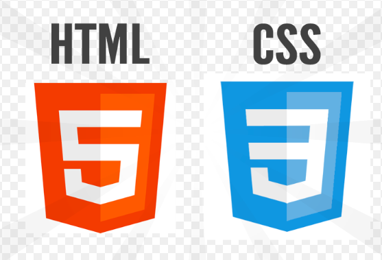
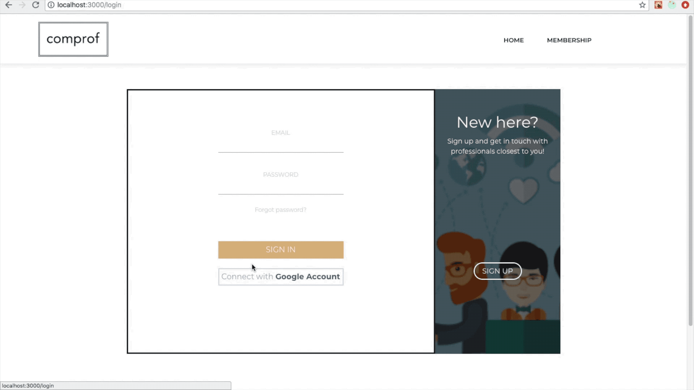
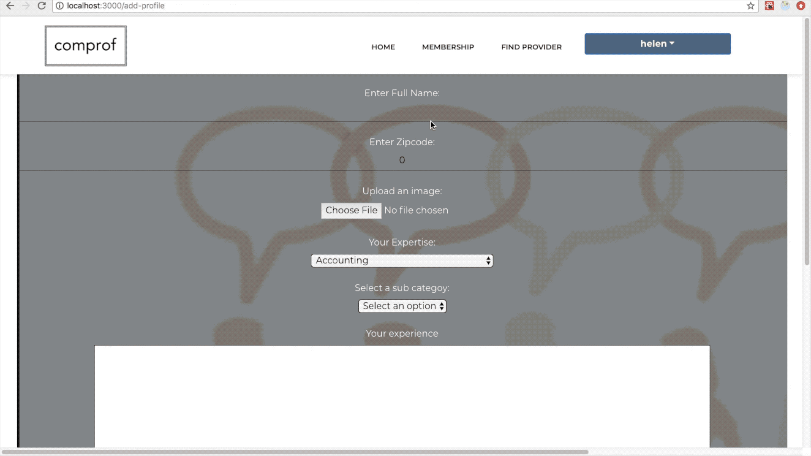
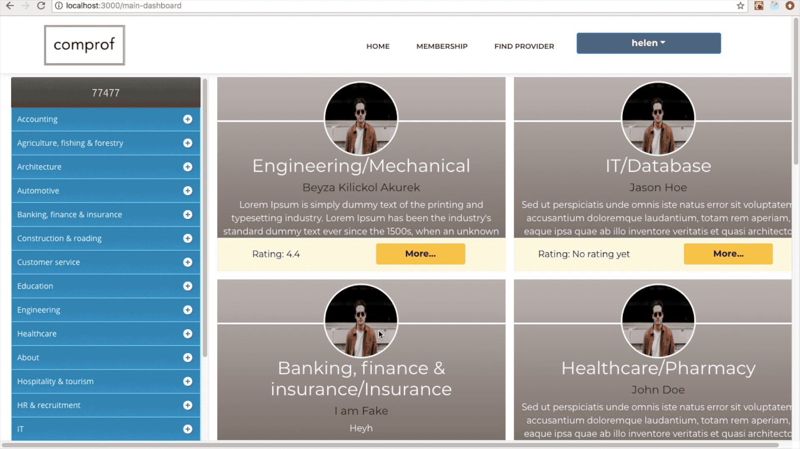

# ComProf-React-Project
* **Front End on the app:**

* **Back End on the app:**

* **Database on the app:**

## Introduction video of the project: 
https://youtu.be/uRPCgXmS6IE

* **Purpose of the app:** 
   Created a platform where clients can meet vendors, professionals and providers by their zip code. Clients can
check their service and quality ratings and contact with them with the messaging system after choosing appropriate membership and make payment for it through Stripe API.
* **How to use:**
   These app has two authentication interfaces, one is for clients, the other one is for professionals. Clients and professionals are given only one right to make search for a professional and to contact with him/her. After making one search, app takes the user to membership page where the user can find all types of membership and enroll to one by making a payment through Stripe API.  
   
   ## User sign up and login: 

   When a professional logs in, he/she can create a profile and release it. After releasing, the user can go back to the profile and edit it. 
   ## Creating profile for professionals: 

   In adition, there is an option where the user can look at his/her full profile. Under 'Find Professional' section, there are main and sub job categories with filtering options so that the user can easily make a search. 
   
   
   
   On profile cards of professionals, there are 'more' button which takes the user to the full profile of that professional. In full profile page, clients can rate the professional based on their service quality and contact with them through the app. 

